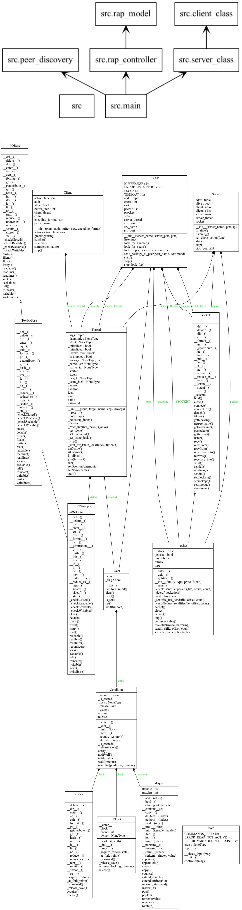

## How to Run Server:

Part I:

```
python3 src/main.py <TCP_PORT>  <REPO_NAME>
```

Part II:

```
python3 src/main.py <TCP_PORT> <UDP_PORT> <REPO_NAME>
```

---

## Client:

A Simple UDP Client:

```
python3 client/client.py <Broadcast Port> <Command|serverList>
```

A Simple TCP Client:

```
while read x; do echo "$x" | nc <SERVER_IP> <SERVER_PORT> ; done < client/text_client.txt > client/output.txt
```

---

## UML

```
pyreverse -o png -p UML  -f ALL -A -S .
```



---

## References:

1. https://stackoverflow.com/questions/27893804/udp-client-server-socket-in-python
2. https://pythontic.com/modules/socket/udp-client-server-example
3. https://stackoverflow.com/questions/59801362/how-can-i-pass-arguments-to-pynput-listener-on-press-function
4. https://gist.github.com/ninedraft/7c47282f8b53ac015c1e326fffb664b5
